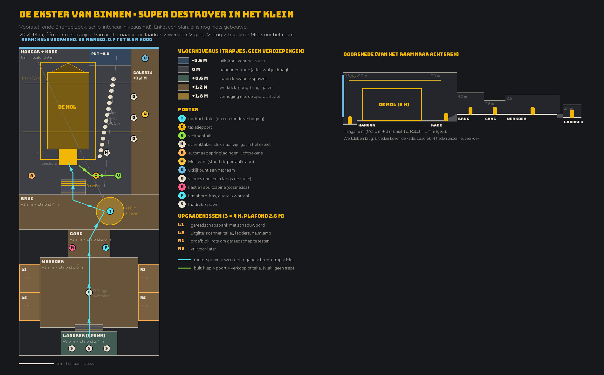

# De Ekster van binnen, ronde 2: hoogteverschillen, upgradehoeken, de hangar

Onderzoek, 2026-10-03.

**Aanleiding.** Jayme na de drie plattegronden uit [schip-interieur](schip-interieur.md) (vrij weergegeven):

> "De interieurontwerpen zijn nog niet echt wow. Ik wil graag hoogteverschillen, maar geen hele verdiepingen: gewoon een paar trapjes. Dan een paar ruimtes waar je allerlei dingen kunt upgraden, want dat komt in de game. En een ruimte met ramen waar de Mol staat. Het museum moet geen aparte ruimte zijn."

Daarna: het moet aanvoelen **"zoals die van Helldivers"**, en een hangar van 16 m is **onnodig hoog**. Daarom is de Super Destroyer van Helldivers 2 hier de ruggengraat. Dit document bouwt verder op schip-interieur (maten op robotschaal, controlelijst tegen de doos, looptijddoelen) en herhaalt die niet. Er wordt nog niets gebouwd. Geluid is aan Jayme: enkel **[plaatshouder]**.

## Kort

1. **De Super Destroyer is één dek met een vaste volgorde:** cryokamer → hoofddek → gang met arsenaal → brug met oorlogstafel → een trapje af naar de pods. Elke overgang is een schot of een paar treden, nooit een verdieping. Wij volgen dezelfde volgorde: **laadrek → werkdek → gang → brug → trap → Mol.**
2. **De hoogteverschillen zijn klein en betekenen iets.** De cryokamer ligt een trap lager dan het hoofddek. Het hoofddek kijkt als een balkon neer op de hangar. De brug heeft een verzonken kuil met consoles voor het raam, en de oorlogstafel staat 2–3 treden hoger.
3. **De ruimtes zijn bescheiden.** Geschat uit screenshots: nissen en cryo ±3 m hoog, hoofddek ±4–5 m, brug ±5 m. Enkel de hangar is hoog, voor de Pelican. Op robotschaal (×0,75) en met een Mol van 6 m: **nissen 2,6 m, werkdek 3,6 m, brug 4 m, hangar 9 m** in plaats van 16.
4. **De look:** donker antraciet, afgeschuinde profielen, schuine liggers, amberen lichtribben rond nissen, witte ledstroken op randen en treden, koud planeetlicht door het raam, banieren, geel-zwarte randen, gele schermen. Dat past bij onze stijlgids: warm is van ons, koud is de diepte.
5. **Posten zijn dingen op een vaste plek:** een ronde tafel op een verhoging, een arcadekast, een tv, terminals in de gang, en de scheepsmodules als diorama-nissen achter een reling die zichtbaar veranderen. Onze upgradehoeken worden zulke nissen, maar dan om in te stappen.
6. **Raam en Mol:** de Mol is 6 m hoog en verbergt het raam als je recht van achteren kijkt. Zet hem uit het midden en kijk schuin vanaf de brug. Het museum hangt en staat langs de route: het grootste skelet in de hangar, vitrines langs de kade, een sokkel midden op het werkdek.
7. **Aanbeveling: "De Ekster als Super Destroyer in het klein".** 20 × 44 m, vloerniveaus −0,6 / 0 / +0,6 / +1,2 / +1,8 m, trappen van 4 of 8 treden, vier upgradenissen rond het werkdek, de terminal op een ronde verhoging op de brug, en vanuit de gang een schuin zicht op de Mol voor het raam.

## 1. De Super Destroyer van binnen

### Volgorde en hoogteverschillen

Uit de wiki's ([Fandom](https://helldivers.fandom.com/wiki/Super_Destroyer), [wiki.gg](https://helldivers.wiki.gg/wiki/Super_Destroyer)) en screenshots (hieronder per ruimte):

| # | Ruimte | Wat er is | Hoogte |
|---|---|---|---|
| 1 | Cryokamer (spawn) | smalle, achthoekige kamer met buizen, banken en cyaan lampjes ([beeld](https://helldivers.fandom.com/wiki/File:HD2_Helldiver_Cryo_Chamber.jpg)); een poort naar het hoofddek | een trap lager: de arcadekast staat "just up the stairs from the cryo chambers" ([wiki](https://helldivers.wiki.gg/wiki/Stratagem_Hero), [Destructoid](https://www.destructoid.com/how-to-play-stratagem-hero-in-helldivers-2/)) |
| 2 | Hoofddek | Ship Master (modules) en Service Technician; links Robotics Workshop en Administration Center, rechts cryo en Engineering Bay; arcadekast *Stratagem Hero*; grote tv | balkon met reling boven de hangar, trappen naar beneden aan beide kanten; Super Earth-embleem gloeit in de vloer ([beeld](https://helldivers.fandom.com/wiki/File:Super_Destroyer_Hangar.jpg)) |
| 3 | Eerste schot: gang | Armory (bakboord), Control Center (stuurboord) | vlak |
| 4 | Tweede schot: brug | Democracy Officer bij de oorlogstafel; technici aan consoles; groot raam | loopbrug met ledrand boven een verzonken kuil vol consoles ([beeld](https://helldivers.wiki.gg/wiki/File:Bridge_Module_Background.png)); de tafel op een ronde verhoging, 2–3 treden hoger ([beeld](https://helldivers.fandom.com/wiki/File:Galactic_War_Table_Background.png)) |
| 5 | Voordek | vier lanceerbuizen voor de pods | "past a small stairwell" (wiki.gg) |
| 6 | Achteraan: hangar | Pelican, Eagle, munitie in rekken, mist, een felle ronde deur | lager dan het hoofddek; loopbruggen langs de zijkant |

**Wat spelers ervan vinden:** aan boord mag je niet sprinten, en de wandeling van de cryobuis naar de tafel voelt lang, zeker na elke herstart ([Steam](https://steamcommunity.com/app/553850/discussions/0/682987821011650828/)). Er is een mod die ze overslaat (ronde 1). Spelers missen een schietbaan (ronde 1).

### Hoe groot het voelt

Geschat uit de screenshots hierboven, met een mens van ±1,8 m als maatstok. Omgerekend met ×0,75 (oog 1,2 m in plaats van ±1,6 m):

| Ruimte | Helldivers 2 (geschat) | × spelerslengte | Robot (voorstel) |
|---|---|---|---|
| Cryokamer | ±3 m, smal | ±1,7× | 2,4 m |
| Module-nis | ±3 m ([beeld](https://helldivers.wiki.gg/wiki/File:Circuit_Expansion_Module_Background.png)) | ±1,7× | 2,6 m |
| Hoofddek | ±4–5 m onder schuine liggers ([beeld](https://helldivers.wiki.gg/wiki/File:Super_Citizen_Edition_DLC_Stratagem_Hero.png)) | ±2,5× | 3,6 m (3,0 m aan de zijkant) |
| Brug, boven de tafel | ±5 m | ±2,8× | 4,0 m |
| Kuil op de brug | ±1,5 m lager | | de kade, 1,2 m onder de brug |
| Verhoging van de tafel | 2–3 treden | | 4 treden, +0,6 m |
| Raam | borstwering ±1 m, tot ±5 m | | borstwering 0,7 m |
| Hangar | ±12–15 m, voor Pelican en Eagle | ±7–8× | **9 m**: Mol 6 m + 3 m |

De hangar volgt het voertuig, niet de speler. Eerdere voorstellen waren 14–18 m ([schip-ontwerp](schip-ontwerp.md)) en 9–12 m ([schip-bouwen-in-blender](schip-bouwen-in-blender.md)). Met 9 m staat de Mol groot in de ruimte, zonder lege lucht erboven.

### Ramen

- **De brug:** een breed panoramaraam met schuine stijlen. Je ziet de rand van de planeet, de eigen kanonnen onder de neus en andere Destroyers ([wiki.gg](https://helldivers.wiki.gg/wiki/Super_Destroyer)).
- **Het uitkijkdek:** een raam met een lage borstwering. Je staat ertegen en kijkt naar beneden, op de wolken en de geschutstorens onder de boeg ([beeld](https://helldivers.fandom.com/wiki/File:View_of_Shete_from_the_Super_Destroyer.jpg)).
- **Het licht reageert:** wit, rood boven een planeet met voorrang, uit boven een verloren planeet.
- **De hangar heeft geen raam:** mist, een felle ronde deur achteraan, kleine oranje vloerlampjes.

### Materiaal, kleur en licht

- **Vormen:** donkere antracieten platen; afgeschuinde, bijna achthoekige profielen in de cryo en de nissen; schuine liggers en A-spanten in het hoofddek en de hangar. Gebouwd met trims en tegelbare texturen (ronde 1).
- **Licht:** amberen lichtribben rond elke nis; witte ledstroken op randen, trapneuzen en de ring van de tafelverhoging; een koude lichtbundel van boven op de tafel, met oranje ringen in het plafond; cyaan in de cryo; geelgroene consoleschermen.
- **Tekens:** zwart-gouden banieren met de schedel, het embleem in de vloer, geel-zwarte randen, bordjes als "VEHICLE BAY" en "UNDER CONSTRUCTION", de tv met nieuws en reclame.
- **Stijl:** volgens een concept-artiest ging de stijl van gedetailleerde sci-fi naar "harsher and more minimalist" ([Örström](https://orstrom.artstation.com/projects/XgygO0)).
- **Voor DIG:** dezelfde middelen, maar goedkoop en zakelijk. Het DIG-logo versleten in de vloer, banieren "Werknemer van het kwartaal: [vacant]", rood licht als de quota in gevaar is.

### Posten als dingen

- **De oorlogstafel:** een lage, ronde console van ±1 m hoog en ±3 m breed, met een hologram, op een ronde verhoging met een ledrand.
- ***Stratagem Hero*:** een lage arcadekast met een schuin scherm tegen de wand.
- **De modules:** de Engineering Bay (werkbanken), de Robotics Workshop (robotarmen) en het Administration Center (een wand vol schermen) zijn nissen achter een reling. Je koopt via de Ship Master, en de nis verandert zichtbaar, net als de buitenkant ([Ship Modules](https://helldivers.fandom.com/wiki/Ship_Modules)).
- **De pods:** vier buizen. Wie erin stapt, is klaar.

## 2. Waarom kleine hoogteverschillen werken

- **Uitzicht en beschutting** (*prospect–refuge*): mensen kiezen plekken waar ze kunnen kijken zonder bekeken te worden. Bij Wright: verhoogde terrassen, lage dakranden, wisselende plafonds ([meta-analyse](https://link.springer.com/article/10.1186/s40410-016-0033-1), [Ostwald](https://www.researchgate.net/publication/263392051_Prospect-Refuge_theory_and_the_textile-block_houses_of_Frank_Lloyd_Wright_An_analysis_of_spatio-visual_characteristics_using_isovists)). De brug van Helldivers is dat: een verhoging met overzicht, en een lage kuil om in te werken.
- **Plafondhoogte en nissen:** overal hetzelfde plafond voelt ongemakkelijk; een nis is half omsloten en lager dan de ruimte ernaast ([patroon 190](https://christopher-alexander-ces-archive.org/record/ceiling-heights-pattern/), [patroon 179](https://patternlanguage.cc/Patterns/Alcoves-(179))).
- ***Raumplan*:** Adolf Loos zette kamers op verschillende hoogtes rond korte trapjes, met schuine doorkijken ([Socks](https://socks-studio.com/2014/03/03/i-do-not-draw-plans-facades-or-sections-adolf-loos-and-the-villa-muller/)).
- **De zitput:** een kort trapje naar een verzonken zithoek met één doorlopende bank ([Wikipedia](https://en.wikipedia.org/wiki/Conversation_pit)).
- **Een regel voor ons:** wat je draagt, blijft vlak; wat je koopt, ligt een trap hoger; wat je kiest, staat het hoogst; wat je bewondert, hangt boven je.

## 3. Maten en botsen

Mensen: trede 7 × 11 inch (32°), bordes om de 12–16 treden, in games 15 × 25–30 cm ([Level Design Book](https://book.leveldesignbook.com/process/blockout/metrics)). Eén losse trede is een valkuil ([InspectApedia](https://inspectapedia.com/Stairs/Stair-Riser-FAQs.php)). Een reling vanaf 0,76 m val, 1,07 m hoog ([IBC](https://grecorailings.com/four-important-ibc-code-requirements-for-guardrails-you-need-to-know/)).

| Voor de robot | Waarde |
|---|---|
| Optrede × aantrede | 0,15 × 0,30 m (26,6°) |
| 0,6 m | 4 treden, 0,9 m lang, geen reling (een zitrand); de robot springt ±1,0 m hoog en kan erop |
| 1,2 m | 8 treden, 2,1 m lang, reling 0,9 m, niet te springen |
| Minimum | 4 treden, nooit één |
| Drempels | ≤ 0,05 m |

- **Godot klimt geen treden.** Boven `floor_max_angle` (45°) is een trede een muur ([docs](https://docs.godotengine.org/en/stable/classes/class_characterbody3d.html)); een capsule rolt over ±0,05 m ([Bugnet](https://bugnet.io/blog/fix-godot-characterbody3d-stairs-climbing-stuck)).
- **Voorstel:** de botsvorm van elke trap is een helling (zoals in Source, [GameDev.net](https://www.gamedev.net/forums/topic/428882-3d-games-and-stairs/)), gemaakt door de trapgenerator met het achtervoegsel `-colonly` ([Godot](https://docs.godotengine.org/en/stable/tutorials/assets_pipeline/importing_3d_scenes/node_type_customization.html)). Een *step-up* met camera-uitsmering kan ook ([dresswithpockets](https://dresswithpockets.github.io/2025/03/19/godot-stair-stepping.html)), maar geeft bij 4,5 m/s 15 schokjes per seconde.
- `floor_constant_speed = true`; `floor_snap_length` 0,1 m houdt je vast op weg naar beneden.
- **Draagroutes blijven vlak.** Wat je draagt, gaat nooit een trap op.

## 4. Upgradehoeken in andere hubs

| Game | Hoe | Wat we lenen |
|---|---|---|
| Helldivers 2 | modules als nissen die zichtbaar veranderen; kopen bij de Ship Master | nissen met een gezicht |
| DRG | wapens als rekwisieten bij de Equipment Terminal; smeden duurt 10–15 s, en spelers maakten een mod om het over te slaan ([wiki](https://deeprockgalactic.wiki.gg/wiki/Space_Rig), [Steam](https://steamcommunity.com/app/548430/discussions/1/4362372646220958187/)) | korte animaties |
| R.E.P.O. | upgrades verschijnen als voorwerpen in de truck ([Game Slayer](https://thegameslayer.com/guides/how-to-get-items-upgrades-in-r-e-p-o/)) | wat je koopt, is een ding |
| Hades | de Spiegel van de Nacht, een paar keer zo hoog als Zagreus ([wiki](https://hades.fandom.com/wiki/Zagreus's_Room)) | één groot ding per soort |
| Mad Max | upgrades veranderen de auto en zijn motorgeluid ([gamepressure](https://www.gamepressure.com/madmax/magnum-opus/zc7c1a)) | Mol-upgrades zie en hoor je |

**Recept per nis:** één groot ding; één lichtkleur en één geluid [plaatshouder]; de keuze op een scherm in de wereld; het resultaat schuift uit een luik of komt op de Mol; animatie ≤ 3–5 s, niet blokkerend. Een **schaduwbord** toont elk gereedschap als omtrek; wat je mist, is een lege omtrek ([Art of Lean](https://artoflean.com/reference/shadow-board/)). Dezelfde taal als de gaten in het museum.

## 5. Raam, Mol en museum

- **De Mol verbergt het raam.** Van achteren, op 12 m, beslaat de Mol (6 × 6 m) ±30° van je zicht, en het raam (20 m breed, 24 m ver) ±45°. Je ziet dan bijna enkel de Mol. Zet de Mol 3 m uit het midden en kijk schuin: de boorkop steekt af tegen de planeet en de helft van het raam blijft vrij. Loos kaderde zijn doorkijken ook schuin.
- **Een voertuig als held.** Atlantis hangt in het Kennedy Space Center gekanteld voor een ledscherm met de aarde, zodat je hem op ooghoogte ziet ([collectSPACE](http://www.collectspace.com/news/news-113012a.html)).
- **Zen View** (Alexander, patroon 134): een uitzicht dat je altijd ziet, slijt. Toon het eerst door een opening, op een overgang ([tekst](https://www.iwritewordsgood.com/apl/patterns/apl134.htm)). Bij ons: door de gang naar de brug, zoals het tweede schot van de Super Destroyer.
- **Het raam verandert:** na een keuze aan de terminal draait een andere planeet in beeld; de dag-nachtgrens schuift; bij de drop gaan de baaideuren open en licht de vloer van onder op.
- **Museum langs de route.** Hintze Hall in Londen heeft tien "wonder bays": nissen met één topstuk ([Dezeen](https://www.dezeen.com/2017/07/17/natural-history-museum-hintze-hall-renovation-hintze-hall-london-casson-mann-whale-skeleton/)). Udvar-Hazy hangt vliegtuigen schuin, "in vlucht" ([Smithsonian](https://www.si.edu/newsdesk/factsheets/national-air-and-space-museum-s-steven-f-udvar-hazy-center)). Rijksmuseum Schiphol hangt tien schilderijen op een doorgangsroute ([amsterdam.info](https://www.amsterdam.info/airport-museum/)).

## Aanbeveling: "De Ekster als Super Destroyer in het klein"

Als tekening, op schaal (`py -3.11 tools/plans/interior_v3_plan.py`):



| Super Destroyer | De Ekster |
|---|---|
| cryokamer, een trap lager | **laadrek** (spawn), +0,6 m, 4 treden onder het werkdek |
| hoofddek met modules, arcadekast, tv, embleem | **werkdek** +1,2 m met vier upgradenissen, speelgoed, tv, DIG-logo met skeletsokkel |
| gang: Armory, Control Center | **gang**: kast met spuitcabine (cosmetica), firmabord (quota, kas, kwartaal) |
| brug: oorlogstafel op een verhoging, kuil, raam | **brug** +1,2 m met de terminal op een ronde verhoging (+1,8 m), uitkijkend over de hangar |
| trapje naar de pods | **trap van 8 treden** naar de kade en de klep van de Mol |
| hangar met Pelican (decor, achteraan) | **hangar** vooraan: de Mol op de baaideuren, het raam, de poort |

```
         0    5    10   15  19 m
        +~~~~~~~~~~~~~~~~~~~~+
z=0     |          .....: U  |
        |   =+----+=    :    |
        |   =|    |=    :    |
z=6     |   =|MOL |=    :    |
        |   =|    |=    o    |
        |   =|    |=    o W  |
z=12    |   =|    |=    o    |
        |   =+-kk-+= H  o    |
        |      kk       :    |
z=18    | A         G  V:    |
        |:::::^^^^:::::::::::|
        |            (T)     |
z=24    |                    |
        |///////K    F///////|
        |///////      ///////|
z=30    |---      tv      ---|
        |L1                R1|
        |---     *DIG     ---|
z=36    |L2                R2|
        |---              ---|
        |//////+-vv----+/////|
z=42    |//////|S  S  S|/////|
        +--------------------+
```

1 teken = 1 m breed, 1 regel = 2 m, het raam is boven. `~` raam · `.` uitkijkput (−0,6) · `=` baaideuren · `k` klep · `:` rand met reling (+1,2) · `^` trap kade → brug (8 treden) · `v` trap werkdek → laadrek (4) · `G` poort · `V` verkoopluik · `H` schenktakel · `A` automaat · `o` vitrine · `U` uitkijkpunt · `W` Mol-werf · `(T)` terminal op verhoging · `K` kast en spuitcabine · `F` firmabord · `*` skeletsokkel · `S` laadrek · `/` techniek.

Doorsnede over de as van de Mol:

```
 9 m +---------------------+
 8 m ~                     |
 7 m ~    [=kraan=]        |
 6 m ~                     |
 5 m ~  +----------+       |
 4 m ~  |          |       +---+   +---------+
 3 m ~  |  MOL     |           +---+         +---+
 2 m ~  |          |        T   gang werkdek     |
 1 m ~  |          |k    /___________________\ S |
 0 m |..============kk__/                     ___|
     0    5    10   15   20   25   30   35   40   m
```

| Ruimte | Vloer | Vrije hoogte | Afmeting |
|---|---|---|---|
| Hangar met kade | 0 | **9 m** | 20 × 21 m |
| Uitkijkput voor het raam | −0,6 m | open | 6 × 2,5 m |
| Galerij stuurboord (Mol-werf, uitkijkpunt) | +1,2 m | open naar de hangar | 4 × 21 m |
| Brug | +1,2 m | 4,0 m voor, 3,0 m onder de luifel | 20 × 5 m |
| Verhoging met terminal | +1,8 m | 3,0 m | Ø 4 m |
| Gang | +1,2 m | 2,6 m | 6 × 4 m |
| Werkdek | +1,2 m | 3,6 m in het midden, 3,0 m aan de zijkant | 14 × 10 m |
| Upgradenissen | +1,2 m | 2,6 m | 3 × 4 m |
| Laadrek | +0,6 m | 2,4 m | 8 × 4 m |

- **Raam:** de hele voorwand, 20 m breed, van 0,7 m tot 8,5 m, met schuine stijlen zoals op de brug van Helldivers. Voor de uitkijkput loopt het glas door tot op de putvloer. Stroken glas van 1 m langs de baaideuren.
- **De Mol** staat met de neus naar het glas, 3 m naar bakboord. Een portaalkraan op 7,5 m rijdt over de Mol: de Mol-werf zet er onderdelen mee op.
- **Licht:** de hangar koel, van het raam; werkdek, nissen en laadrek warm amber; witte ledstroken op elke trapneus en rand; één koude lichtbundel op de terminal. Weinig lampen met schaduw.

**De nissen** (open naar het werkdek, amberen lichtribben, een reling met een opening):

- **L1, de gereedschapsbank:** houweel, boor, grijphandschoen. Een bankschroef en een schaduwbord.
- **L2, de uitgifte:** een balie met een luik voor scanner, takel en touw, ladders, walkietalkie en helmlamp. Wat je koopt, schuift uit het luik.
- **R1, het proefblok:** een blok rots in een kooi om gereedschap te proberen, hersteld na elke dienst, via de `TerrainAPI` (optioneel, later). Ons antwoord op de gemiste schietbaan.
- **R2, vrij voor later.**
- **W, de Mol-werf** (op de galerij, naast de Mol): een console voor de portaalkraan. Boorkop vooraan (silhouet tegen het raam), tanks en hitteschild op de flank, lampen op het dak, lier boven de klep.
- **A, de automaat** voor springladingen en lichtbakens, naast de klep: de laatste stop voor de drop.

**Museum:** het pronkskelet hangt schuin boven de kade aan stuurboord, duikend naar het raam, op 6–8,5 m (naast de Mol, niet erboven). De schenktakel `H`, 3 m van de poort, trekt een geschonken stuk langs een rail naar zijn gat. Iedereen ziet het. [plaatshouder: kettinggeratel, "klik" als het past] Vitrines `o` zitten in de rand van de galerij langs de kade; een lege vitrine toont een silhouet en "GEZOCHT". Een middelgroot skelet staat op de sokkel midden op het werkdek, waar Helldivers zijn embleem heeft.

**Het heldenbeeld.** Je komt uit het laadrek, 4 treden op, over het werkdek langs het skelet, en door de lage gang (2,6 m). Aan het einde van de gang zie je al een strook raam. Op de brug gaat de ruimte open naar 9 m. Je kijkt schuin naar links voor je: de Mol van driekwart achteren, de boorkop tegen de planeet, het skelet rechts in het licht, en de kraan erboven.

| Route | Afstand | Tijd | Doel (ronde 1) |
|---|---|---|---|
| laadrek → terminal | ±20 m | 4,4 s | ≤ 5 s ✓ |
| terminal → klep, trap af | ±11 m | 2,5 s | ≤ 13 m ✓ |
| klep → poort, dragend | ±5 m | 1,8 s (zwaar 2,6 s) | ≤ 4 s ✓ |
| poort → verkoopluik of takel, dragend | ±3 m | 1,1 s | ≤ 4 s ✓ |
| poort → gereedschapsbank | ±21 m | 4,7 s | |
| verste punt (laadrek → uitkijkpunt) | ±46 m | 10 s | ≤ 12 s ✓ |

- **Sterk:** de volgorde van Helldivers; elke overgang is een schot of 4–8 treden; draagroutes vlak; de hangar is half zo hoog als eerst; de Mol en het raam zijn het einde van de route.
- **Zwak:** laadrek → terminal zit tegen de grens van 5 s; het werkdek ziet de Mol niet (net als het hoofddek de pods niet ziet); de galerij aan één kant maakt de hangar scheef.
- **Lage variant:** alles op +0,6 m in plaats van +1,2 m (enkel trappen van 4 treden). Je kijkt dan minder over de kade.

**Volgorde:** (1) een testkaart met treden, relingen en hellingen; (2) dit plan in klei, looptijden meten; (3) vier beelden op ooghoogte voor Jayme: uit de gang, van de verhoging, van de galerij en vanuit de put.

## Vragen voor Jayme

1. Deze volgorde (laadrek → werkdek → gang → brug → Mol) zoals de Super Destroyer: goed?
2. Werkdek en brug op +1,2 m (8 treden naar de kade), of de lage variant op +0,6 m?
3. Hangar 9 m: hoog genoeg?
4. De Mol uit het midden, met de galerij en het skelet aan één kant: goed, of liever symmetrisch?
5. Proefblok in een nis: ja of nee? Wat in R2?

## Zekerheid

- **Vast** (wiki's): de volgorde van de Super Destroyer, de posten en NPC's, "just up the stairs" en "past a small stairwell", de kleur van het licht, de modules die het schip veranderen; de normen en de Godot-standaardwaarden.
- **Geschat uit screenshots:** alle hoogtes van de Super Destroyer (±0,5–1 m). Het aantal treden naar de tafel (2–3) en de kuil (±1,5 m). Voor zekerheid: zelf meten in de game, met de Helldiver als maatstok.
- **Minder zeker:** de zin over "harsher and more minimalist" komt uit een zoekresultaat (ArtStation was geblokkeerd).
- **Eigen voorstellen:** de factor ×0,75, alle robotmaten, de plattegrond, afstanden en tijden. Na akkoord gaan ze naar een indelingstabel en `game/data/tuning/`.

## Bronnen

- **Helldivers 2:** [Super Destroyer (Fandom)](https://helldivers.fandom.com/wiki/Super_Destroyer) · [Super Destroyer (wiki.gg)](https://helldivers.wiki.gg/wiki/Super_Destroyer) · [Ship Modules](https://helldivers.fandom.com/wiki/Ship_Modules) · [Stratagem Hero](https://helldivers.wiki.gg/wiki/Stratagem_Hero) · [Destructoid](https://www.destructoid.com/how-to-play-stratagem-hero-in-helldivers-2/) · [Sprinten aan boord (Steam)](https://steamcommunity.com/app/553850/discussions/0/682987821011650828/) · [Örström (ArtStation)](https://orstrom.artstation.com/projects/XgygO0)
- **Beelden Helldivers 2:** [cryokamer](https://helldivers.fandom.com/wiki/File:HD2_Helldiver_Cryo_Chamber.jpg) · [hoofddek en hangar](https://helldivers.fandom.com/wiki/File:Super_Destroyer_Hangar.jpg) · [arcadekast](https://helldivers.wiki.gg/wiki/File:Super_Citizen_Edition_DLC_Stratagem_Hero.png) · [Engineering Bay](https://helldivers.wiki.gg/wiki/File:Circuit_Expansion_Module_Background.png) · [brug met kuil](https://helldivers.wiki.gg/wiki/File:Bridge_Module_Background.png) · [oorlogstafel](https://helldivers.fandom.com/wiki/File:Galactic_War_Table_Background.png) · [raam](https://helldivers.fandom.com/wiki/File:View_of_Shete_from_the_Super_Destroyer.jpg)
- **Ruimte:** [Prospect–refuge](https://link.springer.com/article/10.1186/s40410-016-0033-1) · [Hildebrand en Wright](https://www.researchgate.net/publication/263392051_Prospect-Refuge_theory_and_the_textile-block_houses_of_Frank_Lloyd_Wright_An_analysis_of_spatio-visual_characteristics_using_isovists) · [Ceiling Height Variety](https://christopher-alexander-ces-archive.org/record/ceiling-heights-pattern/) · [Alcoves](https://patternlanguage.cc/Patterns/Alcoves-(179)) · [Zen View](https://www.iwritewordsgood.com/apl/patterns/apl134.htm) · [Villa Müller](https://socks-studio.com/2014/03/03/i-do-not-draw-plans-facades-or-sections-adolf-loos-and-the-villa-muller/) · [Conversation pit](https://en.wikipedia.org/wiki/Conversation_pit)
- **Hubs en upgrades:** [DRG Space Rig](https://deeprockgalactic.wiki.gg/wiki/Space_Rig) · [Forge overslaan](https://steamcommunity.com/app/548430/discussions/1/4362372646220958187/) · [R.E.P.O.](https://thegameslayer.com/guides/how-to-get-items-upgrades-in-r-e-p-o/) · [Zagreus's Room](https://hades.fandom.com/wiki/Zagreus's_Room) · [Magnum Opus](https://www.gamepressure.com/madmax/magnum-opus/zc7c1a) · [Shadow board](https://artoflean.com/reference/shadow-board/)
- **Raam en museum:** [Atlantis](http://www.collectspace.com/news/news-113012a.html) · [Hintze Hall](https://www.dezeen.com/2017/07/17/natural-history-museum-hintze-hall-renovation-hintze-hall-london-casson-mann-whale-skeleton/) · [Udvar-Hazy](https://www.si.edu/newsdesk/factsheets/national-air-and-space-museum-s-steven-f-udvar-hazy-center) · [Rijksmuseum Schiphol](https://www.amsterdam.info/airport-museum/)
- **Maten en techniek:** [Level Design Book: Metrics](https://book.leveldesignbook.com/process/blockout/metrics) · [Losse trede](https://inspectapedia.com/Stairs/Stair-Riser-FAQs.php) · [IBC-relingen](https://grecorailings.com/four-important-ibc-code-requirements-for-guardrails-you-need-to-know/) · [CharacterBody3D](https://docs.godotengine.org/en/stable/classes/class_characterbody3d.html) · [Capsule op trappen](https://bugnet.io/blog/fix-godot-characterbody3d-stairs-climbing-stuck) · [Stair stepping](https://dresswithpockets.github.io/2025/03/19/godot-stair-stepping.html) · [Trappen als helling](https://www.gamedev.net/forums/topic/428882-3d-games-and-stairs/) · [Import-achtervoegsels](https://docs.godotengine.org/en/stable/tutorials/assets_pipeline/importing_3d_scenes/node_type_customization.html)
